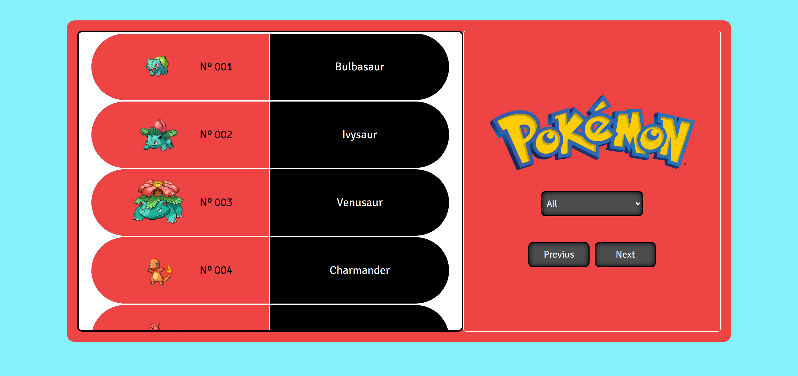

# Pokedex ~ React/Redux Capstone Project

A simple web app, with two pages, one for list the content, an the other one to show the elements information, here i implement the basic and advance React/Redux features such as:
- components
- functional components
- components lifecycle methods
- state and props
- lifting state
- testing
- store
- thunks
- hooks
- prop types
- actions
- reducers



## [Live Link]()

## Built With

- JavaScript
- REACT
- REDUX
- Jest
- HTML
- CSS

## Getting Started

To set up a local copy of the project

- `git clone git@github.com:helman101/Pokedex-Capston.git`
- `cd Pokedex-Capston`
- `npm install`

### Run tests

- Go to your terminal
- Run ```npm test``` to run all the tests.

## Run locally

- Now you are ready to run a local server
- Go to your command line and put `npm start`
- Go to https://localhost:3000/
- Try it!!

## Author

👤 **Andres Ortegon**

- GitHub: [@helman101](https://github.com/helman101)
- Twitter: [@helman1011](https://twitter.com/Helman1011)
- LinkedIn: [Andres Ortegon](https://www.linkedin.com/in/helman101/)

## 🤝 Contributing

Contributions, issues, and feature requests are welcome!

## Show your support

Give a ⭐️ if you like this project!

## 📝 [License](LICENSE)

